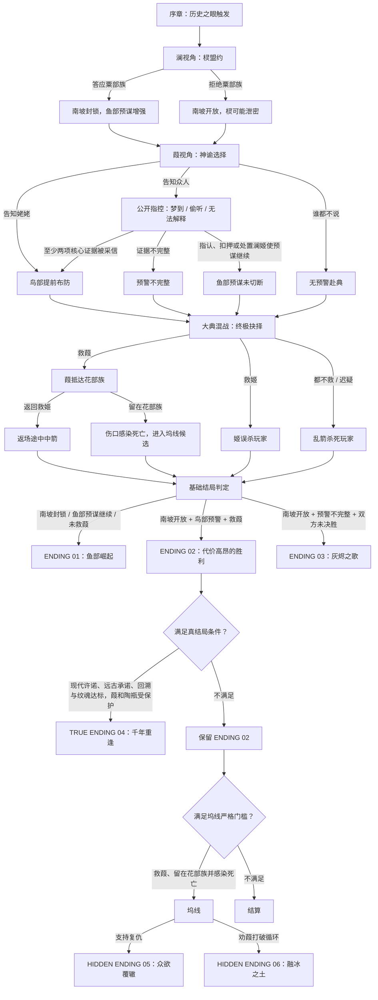

***庙底沟博物馆藏宝城市项目***
-------------------------------------------------------------
藏宝城市庙底沟博物馆实景交互游戏开发

目前仓库属于私人，各位组员想要传播或者游玩请负责或访问连接：

-https://mdgbwg.2101683339.workers.dev/game/

--------------------------------------------------------------

## 游戏结局流程图

当前版本共有 6 个结局：基础结局 3 个、真结局 1 个、隐藏结局 2 个。

结局判定优先级：

`众欲覆辙` → `融冰之土` → `千年重逢` → `灰烬之歌` → `代价高昂的胜利` → `鱼部崛起`

公开指控的四项核心证据：白灰残泥、南坡荆棘、姬的骨饰、粟部族盟约。

#2026.8.14更新:

-完善了剧情框架与人物介绍

-在关键选择节点加入了询问存档功能

-增加了人物介绍背景板

-删除了断电环节

-扩充了存档位置
